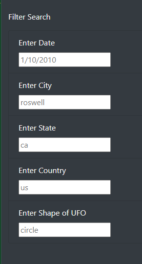
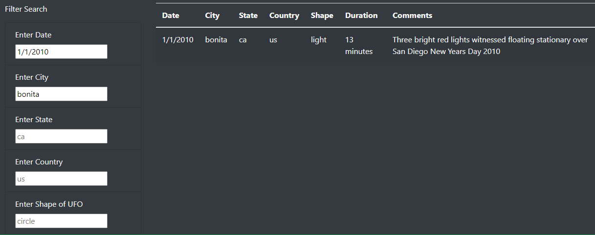

# UFOs
JavaScript, Bootstrap, CSS, HTML
---
---
## Overview  
Dana contracted me to assist her in making a webpage to house her UFO data as well as create a dynamic table within the webpage that would allow users to search through the data easily. This was accomplished with the use of JavaScript and HTML code. Once completed users could filter the table with multiple criteria entries all at the same time.  
## Results  
Dana's new table now allows users to search based on five key areas: date, city, state, country, and/or shape. They may all be utilized together or separately.  

  
*Figure 1: Screenshot of "Filter Search" from Dana's webpage.*  

With this wonderful addition to her website, users can now sift through the numerous UFO sightings with ease! They can use just one of the search boxes shown, or multiple at the same time!  

  
*Figure 2: Image displaying search result.*  

Figure 2 clearly shows a search result that was achieved using multiple entries, but not all. The bottom box listing the shape of the UFO still shows its placeholder entry "circle". This does not match the shape listed in our search result. All other search boxes were utilized to isolate this one sighting entry in Bonita, CA on January 1, 2010.   

## Summary  
One major drawback of the page that I found was sensitivity of the filter search feature. If bonita, ca had been entered as it should have been (Bonita, CA), the search would not have found the entry. That is because the search function is case sensitive as well as format sensitive. For example, if January 1, 2010 were entered just as I wrote it here, the table would have returned no entries at all. Same as if I had put 01/01/2010. To search by the date it MUST be 1/1/2010. No extra zeros, no capitalization, and no incorrect spelling. That's asking quite a lot of the user, in my opinion. These are bugs that will be worked out in the near future.  

Secondly, some color contrast would add to the page as well. Overall this has been a wonderful achievement towards Dana's new UFO webpage!

